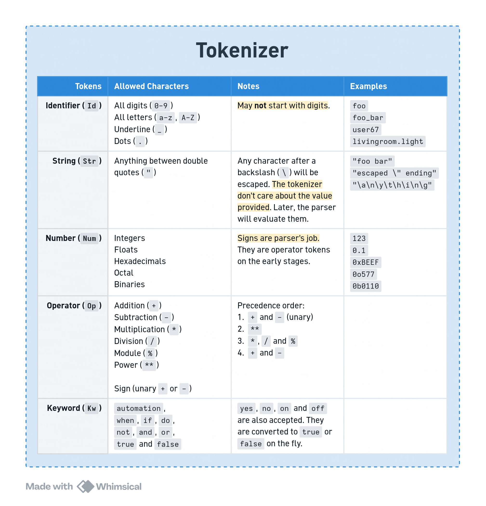
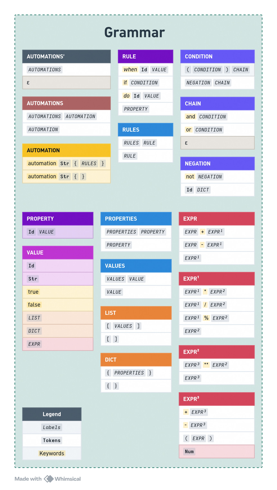
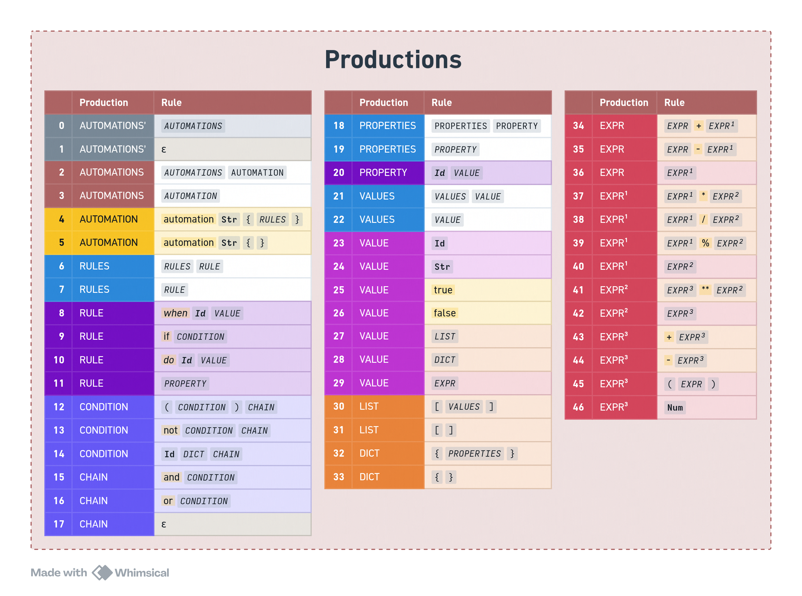

# Homi Language

This is a toy language for converting "readable and natural"
code into a home assistant's valid automation YAML.

For testing purposes, one may test some input by either entering
it after running the program (which starts waiting for input,
without visual confirmation - this is only for debugging
after all) or piping some input; eg. `echo '...' | python gen.py`
or `cat exampleN.homi | python gen.py`

There's no external dependencies but the python runtime.
One "monofile" of a kind is available named `run.py` that
run and log both the lexer and parser, then generate a
correspondent YAML file to `stdout`.

# SLR Parser Generator

This application uses a in-house SLR(1) parser generator, but
you could use one that's publically available for inspection
and/or tinkering, like [this one][slr] instead.

This is because writing the states by hand is pure misery.
Although it should be easier to treat error states.

Even now, I don't know if it was a good decision or no. It's
very cool and practical to alter the grammar for testing, as
I've already said, doing it manually is a pain. But it's also
a pain to treat different panics that may occur, so there's
visible drawbacks on this approach.

[slr]: https://jsmachines.sourceforge.net/machines/slr.html

# Programming Language of Choice

I first thought in using GO for this project, but it turned out
to be a mistake. Not because GO is bad or anything, but because
I wouldn't have the time to finish the project. Deadlines are
kinda important, and GO simply doesn't have almost any "high
level" facilities. The project was in the 1k lines mark just
halfway there, so I migrated the code to python.

# Implementation Details

## Mathematical and Boolean Expressions

This language supports basic mathematical expressions, up to
powers. In the other hand it does not have boolean ones. This is
because of the counterpart, one may never do it in YAML, and so
do here. Note that _nested conditions_ were, actually, supported.
They are the **and**, **or** and **not** special blocks in conditions.

## Empty Blocks

Follows the same logic for boolean expressions. You _can_ make
a empty automation, but home assistant would reject it.

## Ambiguity on State 33

This grammar offers two _unary operators_. These clash with
_add_ and _sub_ operators, so they need an external agent to
rule whose state will be used on a conflict. Unfortunately,
this is not trivial and the simplest solution was to keep the
shift operation directly on the parser.

## Time Syntatic Sugars

Those weren't implemented on this language. Each entity may
accept an arbitrary time scale, and there's nothing we, as
translators, can do to infer the expected one.

## Augmented Grammar

The grammar may be adapted to use only one production as the
start. Here it have been included:

```
FILE -> AUTOMATION'
AUTOMATION' -> AUTOMATIONS
AUTOMATION' -> ε
```

This three rules together allow the user to have an empty file.

## Problems

- Right before sending, some code broke mathematical expressions
and it would take too long to fix. This is sad because it was
working like a charm.

- If there's some entity inside home assistant that uses any
keyword as `Id`, the keyword will be ignored by the parser, thus
breaking most of the file.

- Because there's no specific control in which state it should
sync or fail, file parsing should work most of the time, but
without an external agent actively taking warnings down the user
won't notice anything (expected behavior).

- The problem above also reinforces that this application is
somewhat bad and malformed.

- The grammar is "defined" in two distinct places: first in the
parser; and later (hardcoded) on yaml generator. This makes the
parser generator insignificant, to say the least.

- It's really hard to predict the program behavior when working
with sets, as I've encountered problems regarding hashing order
in two languages because of bad API design.

- When refactoring the codebase, the original boolean acryonms
were lost in the way and I remembered of them too late.

# Tokens (RegEx)

```
Id  -> [\w_][\w\d_\.]*

Str -> ".*"

Num -> \d+
Num -> \d+\.\d+
Num -> 0x[0-9a-fA-F]+
Num -> 0o[0-7]+
Num -> 0b[0-1]+

Op -> + - (unary and binary)
Op -> * / %
Op -> **
Op -> ( )
Op -> [ ]
Op -> { }

Kw -> automation
Kw -> when | if | do
Kw -> not | and | or
Kw -> true | false
Kw -> yes | no
Kw -> on | off
```



# Grammar - SLR(1)

```
AUTOMATION' -> AUTOMATIONS
AUTOMATION' -> ε

AUTOMATION -> automation Str { }
AUTOMATION -> automation Str { RULES }

AUTOMATIONS -> AUTOMATIONS AUTOMATION
AUTOMATIONS -> AUTOMATION

RULE -> when Id DICT
RULE -> if CONDITION
RULE -> do Id DICT
RULE -> PROPERTY

RULES -> RULES RULE
RULES -> RULE

CONDITION -> ( CONDITION ) CHAIN
CONDITION -> NEGATION CHAIN

CHAIN -> and CONDITION
CHAIN -> or CONDITION
CHAIN -> ε

NEGATION -> not NEGATION
NEGATION -> Id DICT

PROPERTY -> Id VALUE

PROPERTIES -> PROPERTIES PROPERTY
PROPERTIES -> PROPERTY

VALUE -> true
VALUE -> false
VALUE -> Id
VALUE -> Str
VALUE -> LIST
VALUE -> DICT
VALUE -> EXPR

VALUES -> VALUES VALUE
VALUES -> VALUE

LIST -> [ ]
LIST -> [ VALUES ]

DICT -> { }
DICT -> { PROPERTIES }

EXPR -> EXPR + EXPR¹
EXPR -> EXPR - EXPR¹
EXPR -> EXPR¹

EXPR¹ -> EXPR¹ * EXPR²
EXPR¹ -> EXPR¹ / EXPR²
EXPR¹ -> EXPR¹ % EXPR²
EXPR¹ -> EXPR²

EXPR² -> EXPR³ ** EXPR²
EXPR² -> EXPR³

EXPR³ -> + EXPR³
EXPR³ -> - EXPR³
EXPR³ -> ( EXPR )
EXPR³ -> Num
```





# State/Goto Tables

|    | automation | Str | {   | }   | when | Id  | if  | do  | (   | )   | and | or  | not | true | false | [   | ]   |  +  |  -  |  *  |  /  |  %  | **  | Num | $   |
|:--:|:----------:|:---:|:---:|:---:|:----:|:---:|:---:|:---:|:---:|:---:|:---:|:---:|:---:|:----:|:-----:|:---:|:---:|:---:|:---:|:---:|:---:|:---:|:---:|:---:|:---:|
| 00 | S3         |     |     |     |      |     |     |     |     |     |     |     |     |      |       |     |     |     |     |     |     |     |     |     | OK  |
| 01 | S3         |     |     |     |      |     |     |     |     |     |     |     |     |      |       |     |     |     |     |     |     |     |     |     |     |
| 02 | R5         |     |     |     |      |     |     |     |     |     |     |     |     |      |       |     |     |     |     |     |     |     |     |     | R5  |
| 03 |            | S5  |     |     |      |     |     |     |     |     |     |     |     |      |       |     |     |     |     |     |     |     |     |     |     |
| 04 | R4         |     |     |     |      |     |     |     |     |     |     |     |     |      |       |     |     |     |     |     |     |     |     |     | R4  |
| 05 |            |     | S6  |     |      |     |     |     |     |     |     |     |     |      |       |     |     |     |     |     |     |     |     |     |     |
| 06 |            |     |     |  S7 | S10  | S14 | S11 | S12 |     |     |     |     |     |      |       |     |     |     |     |     |     |     |     |     |     |
| 07 | R2         |     |     |     |      |     |     |     |     |     |     |     |     |      |       |     |     |     |     |     |     |     |     |     | R2  |
| 08 |            |     |     | S15 | S10  | S14 | S11 | S12 |     |     |     |     |     |      |       |     |     |     |     |     |     |     |     |     |     |
| 09 |            |     |     | R11 | R11  | R11 | R11 | R11 |     |     |     |     |     |      |       |     |     |     |     |     |     |     |     |     |     |
| 10 |            |     |     |     |      | S17 |     |     |     |     |     |     |     |      |       |     |     |     |     |     |     |     |     |     |     |
| 11 |            |     |     |     |      | S22 |     |     | S19 |     |     |     | S21 |      |       |     |     |     |     |     |     |     |     |     |     |
| 12 |            |     |     |     |      | S23 |     |     |     |     |     |     |     |      |       |     |     |     |     |     |     |     |     |     |     |
| 13 |            |     |     | R9  | R9   | R9  | R9  | R9  |     |     |     |     |     |      |       |     |     |     |     |     |     |     |     |     |     |
| 14 |            | S28 | S33 |     |      | S27 |     |     | S39 |     |     |     |     | S25  | S26   | S32 |     | S37 | S38 |     |     |     |     | S40 |     |
| 15 | R3         |     |     |     |      |     |     |     |     |     |     |     |     |      |       |     |     |     |     |     |     |     |     |     | R3  |
| 16 |            |     |     | R10 | R10  | R10 | R10 | R10 |     |     |     |     |     |      |       |     |     |     |     |     |     |     |     |     |     |
| 17 |            |     | S33 |     |      |     |     |     |     |     |     |     |     |      |       |     |     |     |     |     |     |     |     |     |     |
| 18 |            |     |     | R7  | R7   | R7  | R7  | R7  |     |     |     |     |     |      |       |     |     |     |     |     |     |     |     |     |     |
| 19 |            |     |     |     |      | S22 |     |     | S19 |     |     |     | S21 |      |       |     |     |     |     |     |     |     |     |     |     |
| 20 |            |     |     | R16 | R16  | R16 | R16 | R16 |     | R16 | S44 | S45 |     |      |       |     |     |     |     |     |     |     |     |     |     |
| 21 |            |     |     |     |      | S22 |     |     |     |     |     |     | S21 |      |       |     |     |     |     |     |     |     |     |     |     |
| 22 |            |     | S33 |     |      |     |     |     |     |     |     |     |     |      |       |     |     |     |     |     |     |     |     |     |     |
| 23 |            |     | S33 |     |      |     |     |     |     |     |     |     |     |      |       |     |     |     |     |     |     |     |     |     |     |
| 24 |            |     |     | R19 | R19  | R19 | R19 | R19 |     |     |     |     |     |      |       |     |     |     |     |     |     |     |     |     |     |
| 25 |            | R22 | R22 | R22 | R22  | R22 | R22 | R22 | R22 |     |     |     |     | R22  | R22   | R22 | R22 | R22 | R22 |     |     |     |     | R22 |     |
| 26 |            | R23 | R23 | R23 | R23  | R23 | R23 | R23 | R23 |     |     |     |     | R23  | R23   | R23 | R23 | R23 | R23 |     |     |     |     | R23 |     |
| 27 |            | R24 | R24 | R24 | R24  | R24 | R24 | R24 | R24 |     |     |     |     | R24  | R24   | R24 | R24 | R24 | R24 |     |     |     |     | R24 |     |
| 28 |            | R25 | R25 | R25 | R25  | R25 | R25 | R25 | R25 |     |     |     |     | R25  | R25   | R25 | R25 | R25 | R25 |     |     |     |     | R25 |     |
| 29 |            | R26 | R26 | R26 | R26  | R26 | R26 | R26 | R26 |     |     |     |     | R26  | R26   | R26 | R26 | R26 | R26 |     |     |     |     | R26 |     |
| 30 |            | R27 | R27 | R27 | R27  | R27 | R27 | R27 | R27 |     |     |     |     | R27  | R27   | R27 | R27 | R27 | R27 |     |     |     |     | R27 |     |
| 31 |            | R28 | R28 | R28 | R28  | R28 | R28 | R28 | R28 |     |     |     |     | R28  | R28   | R28 | R28 | S49 | S50 |     |     |     |     | R28 |     |
| 32 |            | S28 | S33 |     |      | S27 |     |     | S39 |     |     |     |     | S25  | S26   | S32 | S51 | S37 | S38 |     |     |     |     | S40 |     |
| 33 |            |     |     | S54 |      | S14 |     |     |     |     |     |     |     |      |       |     |     |     |     |     |     |     |     |     |     |
| 34 |            | R37 | R37 | R37 | R37  | R37 | R37 | R37 | R37 | R37 |     |     |     | R37  | R37   | R37 | R37 | R37 | R37 | S57 | S58 | S59 |     | R37 |     |
| 35 |            | R41 | R41 | R41 | R41  | R41 | R41 | R41 | R41 | R41 |     |     |     | R41  | R41   | R41 | R41 | R41 | R41 | R41 | R41 | R41 |     | R41 |     |
| 36 |            | R43 | R43 | R43 | R43  | R43 | R43 | R43 | R43 | R43 |     |     |     | R43  | R43   | R43 | R43 | R43 | R43 | R43 | R43 | R43 | S60 | R43 |     |
| 37 |            |     |     |     |      |     |     |     | S39 |     |     |     |     |      |       |     |     | S37 | S38 |     |     |     |     | S40 |     |
| 38 |            |     |     |     |      |     |     |     | S39 |     |     |     |     |      |       |     |     | S37 | S38 |     |     |     |     | S40 |     |
| 39 |            |     |     |     |      |     |     |     | S39 |     |     |     |     |      |       |     |     | S37 | S38 |     |     |     |     | S40 |     |
| 40 |            | R47 | R47 | R47 | R47  | R47 | R47 | R47 | R47 | R47 |     |     |     | R47  | R47   | R47 | R47 | R47 | R47 | R47 | R47 | R47 | R47 | R47 |     |
| 41 |            |     |     | R6  | R6   | R6  | R6  | R6  |     |     |     |     |     |      |       |     |     |     |     |     |     |     |     |     |     |
| 42 |            |     |     |     |      |     |     |     |     | S64 |     |     |     |      |       |     |     |     |     |     |     |     |     |     |     |
| 43 |            |     |     | R13 | R13  | R13 | R13 | R13 |     | R13 |     |     |     |      |       |     |     |     |     |     |     |     |     |     |     |
| 44 |            |     |     |     |      | S22 |     |     | S19 |     |     |     | S21 |      |       |     |     |     |     |     |     |     |     |     |     |
| 45 |            |     |     |     |      | S22 |     |     | S19 |     |     |     | S21 |      |       |     |     |     |     |     |     |     |     |     |     |
| 46 |            |     |     | R17 | R17  | R17 | R17 | R17 |     | R17 | R17 | R17 |     |      |       |     |     |     |     |     |     |     |     |     |     |
| 47 |            |     |     | R18 | R18  | R18 | R18 | R18 |     | R18 | R18 | R18 |     |      |       |     |     |     |     |     |     |     |     |     |     |
| 48 |            |     |     | R8  | R8   | R8  | R8  | R8  |     |     |     |     |     |      |       |     |     |     |     |     |     |     |     |     |     |
| 49 |            |     |     |     |      |     |     |     | S39 |     |     |     |     |      |       |     |     | S37 | S38 |     |     |     |     | S40 |     |
| 50 |            |     |     |     |      |     |     |     | S39 |     |     |     |     |      |       |     |     | S37 | S38 |     |     |     |     | S40 |     |
| 51 |            | R31 | R31 | R31 | R31  | R31 | R31 | R31 | R31 |     |     |     |     | R31  | R31   | R31 | R31 | R31 | R31 |     |     |     |     | R31 |     |
| 52 |            | S28 | S33 |     |      | S27 |     |     | S39 |     |     |     |     | S25  | S26   | S32 | S69 | S37 | S38 |     |     |     |     | S40 |     |
| 53 |            | R30 | R30 |     |      | R30 |     |     | R30 |     |     |     |     | R30  | R30   | R30 | R30 | R30 | R30 |     |     |     |     | R30 |     |
| 54 |            | R33 | R33 | R33 | R33  | R33 | R33 | R33 | R33 | R33 | R33 | R33 |     | R33  | R33   | R33 | R33 | R33 | R33 |     |     |     |     | R33 |     |
| 55 |            |     |     | S71 |      | S14 |     |     |     |     |     |     |     |      |       |     |     |     |     |     |     |     |     |     |     |
| 56 |            |     |     | R21 |      | R21 |     |     |     |     |     |     |     |      |       |     |     |     |     |     |     |     |     |     |     |
| 57 |            |     |     |     |      |     |     |     | S39 |     |     |     |     |      |       |     |     | S37 | S38 |     |     |     |     | S40 |     |
| 58 |            |     |     |     |      |     |     |     | S39 |     |     |     |     |      |       |     |     | S37 | S38 |     |     |     |     | S40 |     |
| 59 |            |     |     |     |      |     |     |     | S39 |     |     |     |     |      |       |     |     | S37 | S38 |     |     |     |     | S40 |     |
| 60 |            |     |     |     |      |     |     |     | S39 |     |     |     |     |      |       |     |     | S37 | S38 |     |     |     |     | S40 |     |
| 61 |            | R44 | R44 | R44 | R44  | R44 | R44 | R44 | R44 | R44 |     |     |     | R44  | R44   | R44 | R44 | R44 | R44 | R44 | R44 | R44 | R44 | R44 |     |
| 62 |            | R45 | R45 | R45 | R45  | R45 | R45 | R45 | R45 | R45 |     |     |     | R45  | R45   | R45 | R45 | R45 | R45 | R45 | R45 | R45 | R45 | R45 |     |
| 63 |            |     |     |     |      |     |     |     |     | S77 |     |     |     |      |       |     |     | S49 | S50 |     |     |     |     |     |     |
| 64 |            |     |     | R16 | R16  | R16 | R16 | R16 |     | R16 | S44 | S45 |     |      |       |     |     |     |     |     |     |     |     |     |     |
| 65 |            |     |     | R14 | R14  | R14 | R14 | R14 |     | R14 |     |     |     |      |       |     |     |     |     |     |     |     |     |     |     |
| 66 |            |     |     | R15 | R15  | R15 | R15 | R15 |     | R15 |     |     |     |      |       |     |     |     |     |     |     |     |     |     |     |
| 67 |            | R35 | R35 | R35 | R35  | R35 | R35 | R35 | R35 | R35 |     |     |     | R35  | R35   | R35 | R35 | R35 | R35 | S57 | S58 | S59 |     | R35 |     |
| 68 |            | R36 | R36 | R36 | R36  | R36 | R36 | R36 | R36 | R36 |     |     |     | R36  | R36   | R36 | R36 | R36 | R36 | S57 | S58 | S59 |     | R36 |     |
| 69 |            | R32 | R32 | R32 | R32  | R32 | R32 | R32 | R32 |     |     |     |     | R32  | R32   | R32 | R32 | R32 | R32 |     |     |     |     | R32 |     |
| 70 |            | R29 | R29 |     |      | R29 |     |     | R29 |     |     |     |     | R29  | R29   | R29 | R29 | R29 | R29 |     |     |     |     | R29 |     |
| 71 |            | R34 | R34 | R34 | R34  | R34 | R34 | R34 | R34 | R34 | R34 | R34 |     | R34  | R34   | R34 | R34 | R34 | R34 |     |     |     |     | R34 |     |
| 72 |            |     |     | R20 |      | R20 |     |     |     |     |     |     |     |      |       |     |     |     |     |     |     |     |     |     |     |
| 73 |            | R38 | R38 | R38 | R38  | R38 | R38 | R38 | R38 | R38 |     |     |     | R38  | R38   | R38 | R38 | R38 | R38 | R38 | R38 | R38 |     | R38 |     |
| 74 |            | R39 | R39 | R39 | R39  | R39 | R39 | R39 | R39 | R39 |     |     |     | R39  | R39   | R39 | R39 | R39 | R39 | R39 | R39 | R39 |     | R39 |     |
| 75 |            | R40 | R40 | R40 | R40  | R40 | R40 | R40 | R40 | R40 |     |     |     | R40  | R40   | R40 | R40 | R40 | R40 | R40 | R40 | R40 |     | R40 |     |
| 76 |            | R42 | R42 | R42 | R42  | R42 | R42 | R42 | R42 | R42 |     |     |     | R42  | R42   | R42 | R42 | R42 | R42 | R42 | R42 | R42 |     | R42 |     |
| 77 |            | R46 | R46 | R46 | R46  | R46 | R46 | R46 | R46 | R46 |     |     |     | R46  | R46   | R46 | R46 | R46 | R46 | R46 | R46 | R46 | R46 | R46 |     |
| 78 |            |     |     | R12 | R12  | R12 | R12 | R12 |     | R12 |     |     |     |      |       |     |     |     |     |     |     |     |     |     |     |


|             | AUTOMATION' | AUTOMATION | AUTOMATIONS | RULE | RULES | CONDITION | CHAIN | NEGATION | PROPERTY | PROPERTIES | VALUE | VALUES | LIST | DICT | EXPR | EXPR¹ | EXPR² | EXPR³ |
|:-----------:|:-----------:|:----------:|:-----------:|:----:|:-----:|:---------:|:-----:|:--------:|:--------:|:----------:|:-----:|:------:|:----:|:----:|:----:|:-----:|:-----:|:-----:|
| 00          |             | 2          | 1           |      |       |           |       |          |          |            |       |        |      |      |      |       |       |       |
| 01          |             | 4          |             |      |       |           |       |          |          |            |       |        |      |      |      |       |       |       |
| 02          |             |            |             |      |       |           |       |          |          |            |       |        |      |      |      |       |       |       |
| 03          |             |            |             |      |       |           |       |          |          |            |       |        |      |      |      |       |       |       |
| 04          |             |            |             |      |       |           |       |          |          |            |       |        |      |      |      |       |       |       |
| 05          |             |            |             |      |       |           |       |          |          |            |       |        |      |      |      |       |       |       |
| 06          |             |            |             | 9    |  8    |           |       |          | 13       |            |       |        |      |      |      |       |       |       |
| 07          |             |            |             |      |       |           |       |          |          |            |       |        |      |      |      |       |       |       |
| 08          |             |            |             | 16   |       |           |       |          | 13       |            |       |        |      |      |      |       |       |       |
| 09          |             |            |             |      |       |           |       |          |          |            |       |        |      |      |      |       |       |       |
| 10          |             |            |             |      |       |           |       |          |          |            |       |        |      |      |      |       |       |       |
| 11          |             |            |             |      |       | 18        |       | 20       |          |            |       |        |      |      |      |       |       |       |
| 12          |             |            |             |      |       |           |       |          |          |            |       |        |      |      |      |       |       |       |
| 13          |             |            |             |      |       |           |       |          |          |            |       |        |      |      |      |       |       |       |
| 14          |             |            |             |      |       |           |       |          |          |            |  24   |        | 29   | 30   | 31   | 34    | 35    | 36    |
| 15          |             |            |             |      |       |           |       |          |          |            |       |        |      |      |      |       |       |       |
| 16          |             |            |             |      |       |           |       |          |          |            |       |        |      |      |      |       |       |       |
| 17          |             |            |             |      |       |           |       |          |          |            |       |        |      | 41   |      |       |       |       |
| 18          |             |            |             |      |       |           |       |          |          |            |       |        |      |      |      |       |       |       |
| 19          |             |            |             |      |       | 42        |       | 20       |          |            |       |        |      |      |      |       |       |       |
| 20          |             |            |             |      |       |           |  43   |          |          |            |       |        |      |      |      |       |       |       |
| 21          |             |            |             |      |       |           |       | 46       |          |            |       |        |      |      |      |       |       |       |
| 22          |             |            |             |      |       |           |       |          |          |            |       |        |      | 47   |      |       |       |       |
| 23          |             |            |             |      |       |           |       |          |          |            |       |        |      | 48   |      |       |       |       |
| 24          |             |            |             |      |       |           |       |          |          |            |       |        |      |      |      |       |       |       |
| 25          |             |            |             |      |       |           |       |          |          |            |       |        |      |      |      |       |       |       |
| 26          |             |            |             |      |       |           |       |          |          |            |       |        |      |      |      |       |       |       |
| 27          |             |            |             |      |       |           |       |          |          |            |       |        |      |      |      |       |       |       |
| 28          |             |            |             |      |       |           |       |          |          |            |       |        |      |      |      |       |       |       |
| 29          |             |            |             |      |       |           |       |          |          |            |       |        |      |      |      |       |       |       |
| 30          |             |            |             |      |       |           |       |          |          |            |       |        |      |      |      |       |       |       |
| 31          |             |            |             |      |       |           |       |          |          |            |       |        |      |      |      |       |       |       |
| 32          |             |            |             |      |       |           |       |          |          |            |  53   | 52     | 29   | 30   | 31   | 34    | 35    | 36    |
| 33          |             |            |             |      |       |           |       |          | 56       | 55         |       |        |      |      |      |       |       |       |
| 34          |             |            |             |      |       |           |       |          |          |            |       |        |      |      |      |       |       |       |
| 35          |             |            |             |      |       |           |       |          |          |            |       |        |      |      |      |       |       |       |
| 36          |             |            |             |      |       |           |       |          |          |            |       |        |      |      |      |       |       |       |
| 37          |             |            |             |      |       |           |       |          |          |            |       |        |      |      |      |       |       | 61    |
| 38          |             |            |             |      |       |           |       |          |          |            |       |        |      |      |      |       |       | 62    |
| 39          |             |            |             |      |       |           |       |          |          |            |       |        |      |      | 63   | 34    | 35    | 36    |
| 40          |             |            |             |      |       |           |       |          |          |            |       |        |      |      |      |       |       |       |
| 41          |             |            |             |      |       |           |       |          |          |            |       |        |      |      |      |       |       |       |
| 42          |             |            |             |      |       |           |       |          |          |            |       |        |      |      |      |       |       |       |
| 43          |             |            |             |      |       |           |       |          |          |            |       |        |      |      |      |       |       |       |
| 44          |             |            |             |      |       | 65        |       | 20       |          |            |       |        |      |      |      |       |       |       |
| 45          |             |            |             |      |       | 66        |       | 20       |          |            |       |        |      |      |      |       |       |       |
| 46          |             |            |             |      |       |           |       |          |          |            |       |        |      |      |      |       |       |       |
| 47          |             |            |             |      |       |           |       |          |          |            |       |        |      |      |      |       |       |       |
| 48          |             |            |             |      |       |           |       |          |          |            |       |        |      |      |      |       |       |       |
| 49          |             |            |             |      |       |           |       |          |          |            |       |        |      |      |      | 67    | 35    | 36    |
| 50          |             |            |             |      |       |           |       |          |          |            |       |        |      |      |      | 68    | 35    | 36    |
| 51          |             |            |             |      |       |           |       |          |          |            |       |        |      |      |      |       |       |       |
| 52          |             |            |             |      |       |           |       |          |          |            |  70   |        | 29   | 30   | 31   | 34    | 35    | 36    |
| 53          |             |            |             |      |       |           |       |          |          |            |       |        |      |      |      |       |       |       |
| 54          |             |            |             |      |       |           |       |          |          |            |       |        |      |      |      |       |       |       |
| 55          |             |            |             |      |       |           |       |          | 72       |            |       |        |      |      |      |       |       |       |
| 56          |             |            |             |      |       |           |       |          |          |            |       |        |      |      |      |       |       |       |
| 57          |             |            |             |      |       |           |       |          |          |            |       |        |      |      |      |       | 73    | 36    |
| 58          |             |            |             |      |       |           |       |          |          |            |       |        |      |      |      |       | 74    | 36    |
| 59          |             |            |             |      |       |           |       |          |          |            |       |        |      |      |      |       | 75    | 36    |
| 60          |             |            |             |      |       |           |       |          |          |            |       |        |      |      |      |       | 76    | 36    |
| 61          |             |            |             |      |       |           |       |          |          |            |       |        |      |      |      |       |       |       |
| 62          |             |            |             |      |       |           |       |          |          |            |       |        |      |      |      |       |       |       |
| 63          |             |            |             |      |       |           |       |          |          |            |       |        |      |      |      |       |       |       |
| 64          |             |            |             |      |       |           |  78   |          |          |            |       |        |      |      |      |       |       |       |
| 65          |             |            |             |      |       |           |       |          |          |            |       |        |      |      |      |       |       |       |
| 66          |             |            |             |      |       |           |       |          |          |            |       |        |      |      |      |       |       |       |
| 67          |             |            |             |      |       |           |       |          |          |            |       |        |      |      |      |       |       |       |
| 68          |             |            |             |      |       |           |       |          |          |            |       |        |      |      |      |       |       |       |
| 69          |             |            |             |      |       |           |       |          |          |            |       |        |      |      |      |       |       |       |
| 70          |             |            |             |      |       |           |       |          |          |            |       |        |      |      |      |       |       |       |
| 71          |             |            |             |      |       |           |       |          |          |            |       |        |      |      |      |       |       |       |
| 72          |             |            |             |      |       |           |       |          |          |            |       |        |      |      |      |       |       |       |
| 73          |             |            |             |      |       |           |       |          |          |            |       |        |      |      |      |       |       |       |
| 74          |             |            |             |      |       |           |       |          |          |            |       |        |      |      |      |       |       |       |
| 75          |             |            |             |      |       |           |       |          |          |            |       |        |      |      |      |       |       |       |
| 76          |             |            |             |      |       |           |       |          |          |            |       |        |      |      |      |       |       |       |
| 77          |             |            |             |      |       |           |       |          |          |            |       |        |      |      |      |       |       |       |
| 78          |             |            |             |      |       |           |       |          |          |            |       |        |      |      |      |       |       |       |


